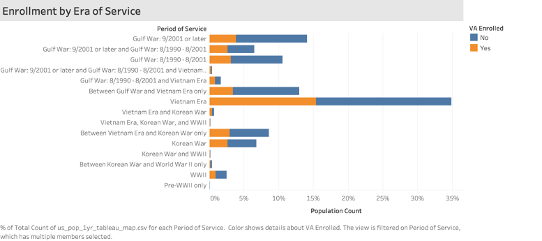
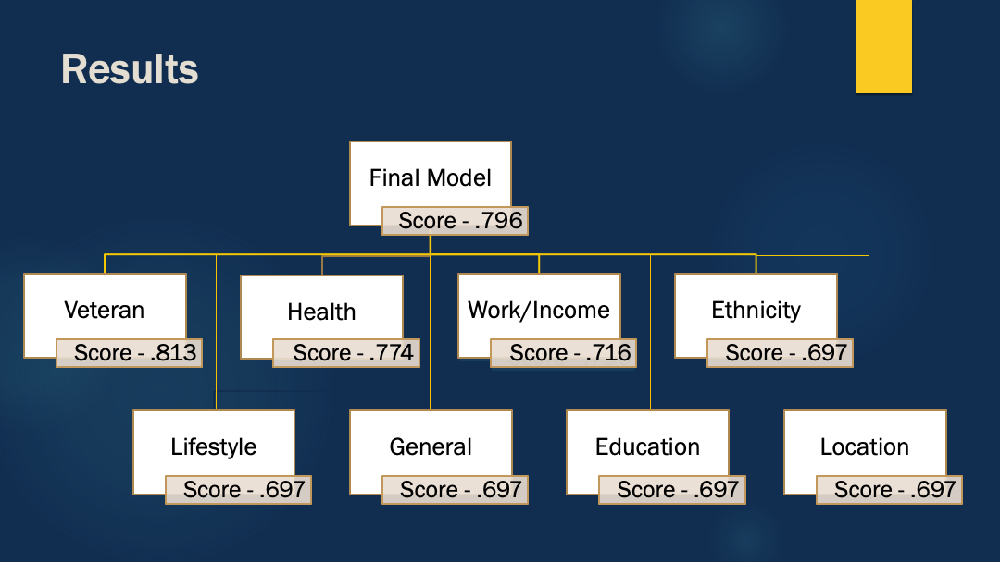

# VA Enrollment  Analysis
---

## Executive Summary
---
Every year roughly 200,000 service members leave the military according to the Veterans Adminstration (VA). The VA is one of the largest components of the Federal Govenrment Out side of the Armed Forces and provides a wide array services for Veterans that extends well beyond healthcare.  However, a [Congressional Research Service (CSR) report compiled in 2014](https://fas.org/sgp/crs/misc/R43579.pdf) showed only 42% of eligible Veterans enrolled in the VA.  As a result, the VA neither tracks these Veterans nor are they able to refer these veterans to other organizations or groups that provide community.  This project attempts to identify the characteristics indicate of these individuals  will not enroll and the characteristics of non-enrollees.

Roughly 25% of enrolled Veterans have a service connected disability according to [VA Enrollment Reports](https://www.va.gov/HEALTHPOLICYPLANNING/SOE2018/2018EnrolleeDataFindingsReport_9January2019Final508Compliant.pdf). By grouping features into themes and utilizing logistic regression, this project builds several models that do a good job of identifying the attributes of Veterans that do and do not enroll in the VA.


## Data Science Questions
---
1. Who are the veterans that do not enroll in the VA?  
2. Do Veterans that choose not to enroll have identifiable characteristics?  

## Data
---
For this project, I ustilized the Public Use Microset data for 2018 that is pucblished by the United States Census Bureau.  It represents a sample of roughly 1% of the US population.  The data is published annually with American ACS updating the data from the decennial Census.  More information about this data set and [technical documentation](https://www.census.gov/programs-surveys/acs/technical-documentation/pums/documentation.html) can be found on the Census website. 

The raw dataset can be downloaded from the census FTP site.  Data is available in state specific sets for both housing and population.  For this project I focused on 1yr and 5 yr US Population datasets.  While housing information is of considerable interest when discussing veterans, it is outside the scope fo this project.

* [2018 1 Year PUMs Dataset Download (589 MBs Zipped).](https://www2.census.gov/programs-surveys/acs/data/pums/2018/1-Year/unix_pus.zip)
* [2014-2018 5 Year PUMs Dataset Download (2.3 GBs Zipped)](https://www2.census.gov/programs-surveys/acs/data/pums/2018/5-Year/unix_pus.zip)

## Data Compression and Cleaning 
---
**NOTE** - These datasets 2.8 million records and 14.9 million records respectively.  Processing the 5yr PUMs dataset requires a minimum of 16 GB of RAM.

* **Compression:** PUMs data is startlingly exhaustive and came in multiple sets. The 1 year PUMs is in 2 CSV files aand the 5 year data is in 4 sets.  The data dictionary is 132 pages.  However, most of the features that the Census Bureau capture are not necessaryily of interest.  Removing those columns not only simplified that dataset, it was necessary for to make the set small enough to run locally. Additionally, anyone under the age of 18 is removed from teh datasets because you cannot serve in the military prior to that age. Only after this unnecessary data is removed are the sets small enough to be combined into one dataset and saved locally.  

* **Cleaning:** Only after compressing the datasets to a workable size, did the work of cleaningthe data begin.  PUMs data presented some interesting challenges. First and foremost, nulls are rarely true nulls.  In many cases, a null return actually implies a value.  For instance, a null in ```MAR``` means never married.  Therefore, null treatment was decided on a feature by feature basis.  

## Modeling
---
Since ```HINS6``` measures VA Enrollment with a simple yes(1) or no(2), it is perfect dependent variable for classification.  I tested an array of classification for optimal performance based on score, fit and variance.    

**Models Tested**
1. Logisitic Regression
2. K Nearest Neighbors
3. Random Forest
4. Gaussian Naive Bayes
5. Bernoulli Naive Bayes
6. Multinomial Naive Bayes
7. Decision Trees
8. Random Forest
9. Extra Trees
10. ADA Boost
11. Guassian Process
12. Support Vector Classifier
13. Linear Support Vector Classifier

In the end, Logistic Regression consistently out performed the other models. It demonstrated to fit better, minimize variance, take less computing power and deliver interpretable results.  Therefore, the preferred classifier going forward is Logistic Regression. Additionally, I used both Sci-Kit Learn's ```LogisticRegression()``` and Stats Model ```Logit()``` to optimize the models.

I categorized features into groups based on similarity.  This helped determine if larger themes displayed predictive ability beyond the individual features.  It also helped identify multicollinearity in the features, which could then be reduced.  

## Findings
---

For future reference, the baseline model for the VA Enrollment feature, ```HINS6```, is .697.


   
* **Veteran Feature Group** - This is the best performing feature group with a score of .81.  Considering the highly subjective nature of the data, any scores above .8 demonstrate a very good fit.  Additionlly, the test score of .81 indicates minimal variance.  
* **Work/Income Group** -
* **Ethnicity Group** - Baseline
* **Health Group** - 
* **Lifestyle Group** - Baseline.  No feaures
* **General Group** - Baseline
* **Location Group** - Baseline. No features
* **Education Group** - Baseline

#### Final Combined Model
The final model 

The surprises are more about what variables are not important as opposed to those that are.

## Project Organization
---
```
project-directory  
|__ 1yr_pums  
|   |__ Place 1yr dataset CSVs in this directory
|__ 5yr_pums 
|__ |__ Place 5yr dataset CSVs in this directory
|__ background 
|__ |__ Veteran data for comparison and future research
|__ code
|   |__ 01_data_import_and_combine.ipynb
|   |__ 02_data_cleaning.ipynb   
|   |__ 03_classification.ipynb  
|__tableau_data
|   |__ 01_tableau_build.ipnyb
|   |__ pop1_analysis.twb
|   |__ vet1_analysis.twb
|   |__ Tableau CSVs will be saved here
|__ visuals
|__ work_in_progress
|__ |__ Clustering.ipnyb
|__ |__ EDA_visuals.ipnyb
|__ working_data
|   |__ Compressed and cleaned CSVs will be saved here
|__ presentation.pdf
|__ README.md
```
## Additional Resources
---
A google document of all additional research and resources can be found [here](https://docs.google.com/document/d/1-CDyHBpFiIGXZlgoX5nltieaSrE90ro81Xj3a7jC2Mk/edit?usp=sharing).

## Follow On Work
---
This data set contains a great amount of incites that are outside of today's project.  Several ways I plan to continue work on this data set:

* Clustering for grouping 
* NN for classification
* Other mining techniques